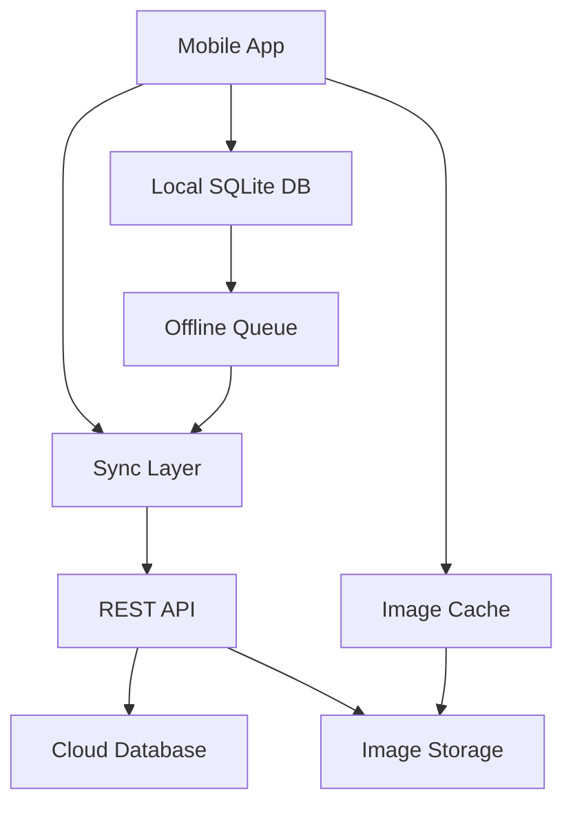

# 📱 Repair Shop Management System

A comprehensive management system for mobile and accessories stores that handles inventory management, customer relationships, and repair services with offline/online synchronization capabilities.

## 📋 Project Overview

This application is designed for a mobile and accessories store that performs device repairs. The system manages:

- **Inventory Management**: Items, categories, stock tracking with IMEI support
- **Customer Management**: Dealers and customers with comprehensive contact information
- **Repair Management**: Full repair lifecycle with issue tracking and image documentation
- **Offline/Online Sync**: Seamless operation regardless of internet connectivity

## 📚 Documentation

| Document                                  | Description                                     |
| ----------------------------------------- | ----------------------------------------------- |
| [📖 project_tasks.md](./project_tasks.md) | Consolidated project tasks, status, and roadmap |

## 🚀 Quick Start

### Prerequisites

- Node.js 18+ or Python 3.9+
- React Native CLI or Flutter SDK
- SQLite
- Git

### Development Setup

1. **Clone and Initialize**

   ```bash
   git clone <repository-url>
   cd repair_shop
   npm install  # or yarn install
   ```

2. **Database Setup**

   ```bash
   # Initialize local SQLite database
   npm run db:init
   npm run db:migrate
   npm run db:seed
   ```

3. **Start Development**

   ```bash
   # Start the backend server
   npm run server:dev

   # Start the mobile app (in another terminal)
   npm run mobile:android  # or mobile:ios
   ```

## 🎯 Current Status

### ✅ Completed

- [x] Project specification and requirements analysis
- [x] Technical architecture design
- [x] Database schema design
- [x] Development roadmap planning

### 🔄 In Progress

- [ ] Technology stack finalization
- [ ] Development environment setup
- [ ] Project initialization

### 📅 Next Steps (Week 1-2)

1. **Technology Stack Decision**

   - Frontend: React Native vs Flutter
   - Backend: Node.js vs Python
   - Database ORM selection

2. **Project Initialization**

   - Repository setup
   - Development environment configuration
   - Basic project structure

3. **Database Implementation**
   - SQLite schema implementation
   - Migration system setup
   - Initial data models

## 🏗️ System Architecture



## 📊 Key Features

### 🏪 Inventory Management

- ✅ Custom categories with hierarchy
- ✅ Item tracking with IMEI support
- ✅ Batch management for bulk purchases
- ✅ Stock level monitoring and alerts
- ✅ Quality and condition tracking

### 👥 Customer Management

- ✅ Dealer and customer differentiation
- ✅ Comprehensive contact information
- ✅ Transaction history tracking
- ✅ Customer relationship management

### 🔧 Repair Management

- ✅ Complete repair lifecycle tracking
- ✅ Issue categorization and tracking
- ✅ Image documentation (before/during/after)
- ✅ State-based workflow management
- ✅ Stock usage tracking in repairs

### 🔄 Synchronization

- ✅ Offline-first architecture
- ✅ Automatic background sync
- ✅ Conflict resolution system
- ✅ Image synchronization
- ✅ Queue-based sync operations

## 🛠️ Technology Stack (Proposed)

### Frontend Options

| Technology          | Pros                             | Cons                    | Status           |
| ------------------- | -------------------------------- | ----------------------- | ---------------- |
| React Native        | Single codebase, large ecosystem | Platform issues         | ⭐ Recommended   |
| Flutter             | Great performance, excellent UI  | Learning curve          | 🔍 Considering   |
| Progressive Web App | Universal access                 | Limited native features | 📋 Backup option |

### Backend Options

| Technology        | Pros                                     | Cons                 | Status           |
| ----------------- | ---------------------------------------- | -------------------- | ---------------- |
| Node.js + Express | JavaScript ecosystem, fast development   | Single-threaded      | ⭐ Recommended   |
| Python + FastAPI  | Type safety, excellent async support     | Performance overhead | 🔍 Considering   |
| Go + Gin          | Excellent performance, simple deployment | Learning curve       | 📋 Future option |

## 📁 Project Structure (Planned)

```
repair_shop/
├── 📱 mobile/                 # Mobile application
│   ├── src/
│   │   ├── components/        # Reusable components
│   │   ├── screens/           # App screens
│   │   ├── services/          # API and data services
│   │   ├── utils/             # Helper functions
│   │   └── types/             # TypeScript definitions
│   ├── assets/                # Images, fonts, etc.
│   └── tests/                 # Test files
├── 🖥️ server/                 # Backend API
│   ├── src/
│   │   ├── controllers/       # Route handlers
│   │   ├── services/          # Business logic
│   │   ├── models/            # Database models
│   │   ├── middleware/        # Auth, validation
│   │   └── utils/             # Helper functions
│   ├── migrations/            # Database migrations
│   └── tests/                 # Test files
├── 🗄️ database/               # Database related files
│   ├── schema.sql             # Database schema
│   ├── migrations/            # Migration files
│   └── seeds/                 # Seed data
├── 📚 docs/                   # Documentation
├── 🧪 tests/                  # Integration tests
└── 📦 scripts/                # Build and deployment scripts
```

## 🎯 Development Phases

| Phase       | Timeline    | Focus                  | Status       |
| ----------- | ----------- | ---------------------- | ------------ |
| **Phase 1** | Weeks 1-2   | Foundation Setup       | 🔄 Planning  |
| **Phase 2** | Weeks 3-4   | Inventory Management   | 📅 Scheduled |
| **Phase 3** | Week 5      | Customer Management    | 📅 Scheduled |
| **Phase 4** | Weeks 6-7   | Repair Management Core | 📅 Scheduled |
| **Phase 5** | Weeks 8-9   | Advanced Features      | 📅 Scheduled |
| **Phase 6** | Weeks 10-11 | Synchronization System | 📅 Scheduled |
| **Phase 7** | Week 12     | Polish & Deployment    | 📅 Scheduled |

## 📊 Success Metrics

### Technical KPIs

- 🚀 App startup time: < 3 seconds
- 📊 Database query performance: < 100ms
- 🔄 Sync success rate: > 95%
- 📱 Offline functionality: 100% data preservation

### Business KPIs

- ⚡ Repair processing efficiency improvement
- 📈 Inventory accuracy improvement
- 😊 Customer satisfaction score
- ⏱️ System uptime: > 99.5%

## 🤝 Contributing

### Development Workflow

1. Create feature branch from `develop`
2. Implement feature following coding standards
3. Write tests for new functionality
4. Submit pull request with description
5. Code review and testing
6. Merge to develop branch

### Coding Standards

- Use TypeScript for type safety
- Follow ESLint configuration
- Write unit tests for business logic
- Document API endpoints
- Use conventional commits

## 📞 Support & Contact

For questions, suggestions, or support:

- 📧 Project Lead: [Your Email]
- 📋 Issue Tracker: [GitHub Issues]
- 📖 Wiki: [Project Wiki]
- 💬 Discussion: [GitHub Discussions]

## 📄 License

This project is proprietary software developed for [Client Name]. All rights reserved.

---

**Last Updated**: October 27, 2025  
**Project Status**: Planning Phase  
**Next Milestone**: Technology Stack Decision & Project Setup
